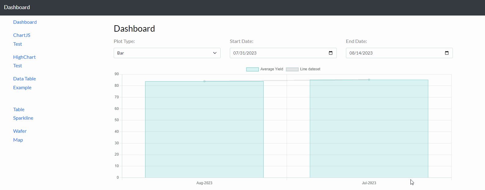
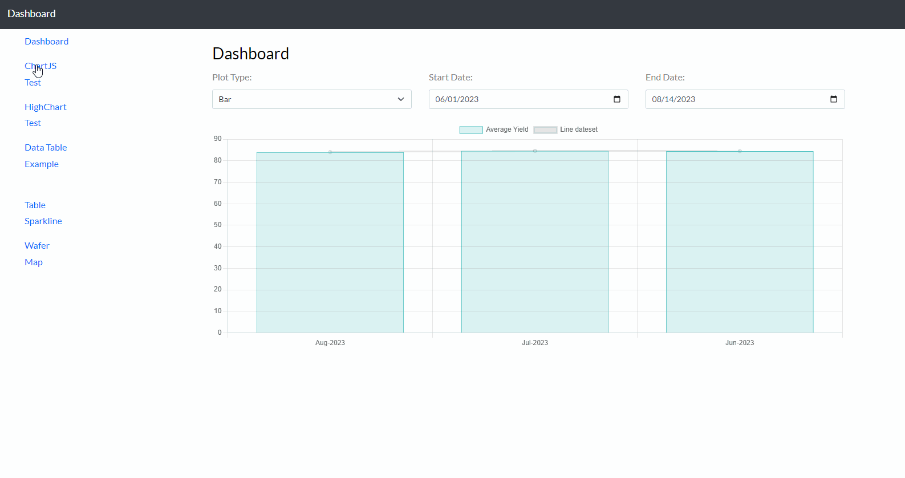
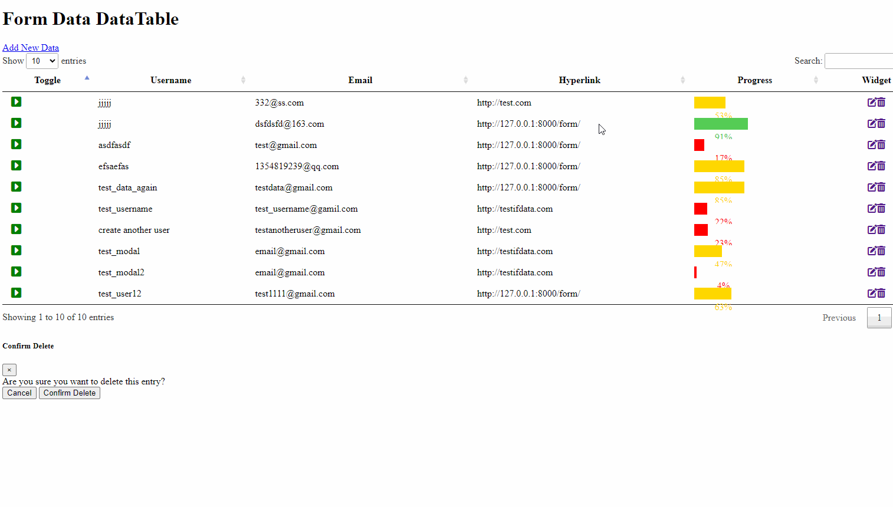
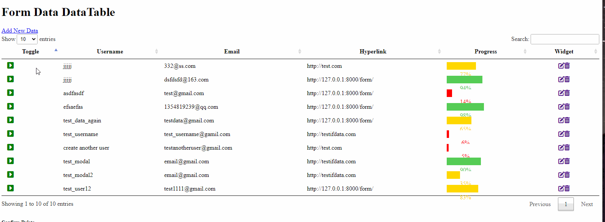
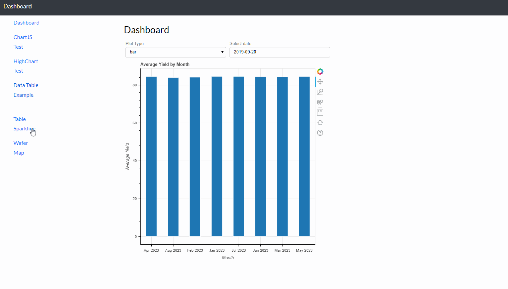

# Django Project For Visualization

This is a django project for me to practice the data visualization skills using the Django framework. 

## Features

- Feature 1: ChartJS and Django integration.
- Feature 2: Highchart JS and Django integration.
- Feature 3: Datatable and Progrsebar integration using Django
- Feature 4: Render Form Using Django Crispy and Update the DataTable
- Feature 5: Table Sparkline using the DataTable JS and Django 
- Feature 6: Wafer Map on Django use D3.js (Currently the Fastest Way to Render Wafer Map)
... [continue working on other features.....]

## Demo GIFs

Here are some animated GIFs that demonstrate the features and functionalities of this project:

### chartjs demo


### highchart demo


### datatablejs progressbar and toggle button demo


### highchart demo


### wafermap demo


... [repeat as necessary for each feature you want to highlight]

## Installation

1. **Clone the repository**:
    ```bash
    git clone YOUR_REPO_LINK_HERE
    ```

2. **Navigate to the project directory**:
    ```bash
    cd YOUR_PROJECT_DIRECTORY
    ```

3. **Set up a virtual environment**:
    ```bash
    python -m venv venv
    ```

4. **Activate the virtual environment**:
    - On Windows:
    ```bash
    .\venv\Scripts\activate
    ```
    - On MacOS/Linux:
    ```bash
    source venv/bin/activate
    ```

5. **Install the requirements**:
    ```bash
    pip install -r requirements.txt
    ```

6. **Run migrations**:
    ```bash
    python manage.py migrate
    ```

7. **Run the Django server**:
    ```bash
    python manage.py runserver
    ```

## Usage

Python manage.py runserver

## Contributing

If you want to accept contributions to your project, provide guidelines on how others can do this.

1. Fork the Project
2. Create your Feature Branch (`git checkout -b feature/YourFeature`)
3. Commit your Changes (`git commit -m 'Add some YourFeature'`)
4. Push to the Branch (`git push origin feature/YourFeature`)
5. Open a Pull Request

## License

This project is licensed under the MIT License. See the [LICENSE](LICENSE) file for more details.


